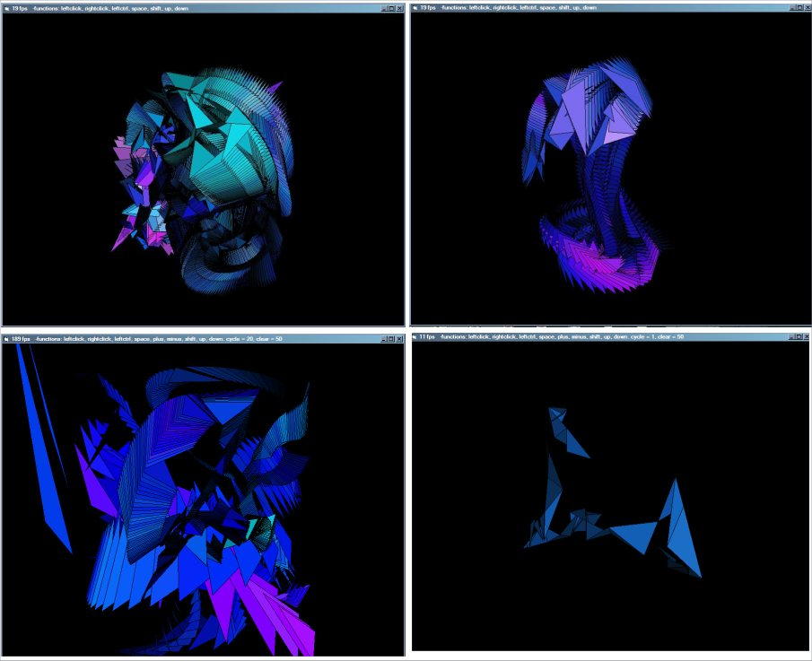



## m2 3d polygon engine

### Description

A 3D engine in VB, using polygon drawing on a form. Not as fast as DirectX, no textures, and probably not good for a game, but still fast enough to make an interesting screensaver.
 
### More Info
 
to use the 3d engine, must understand 3d space coordinates, and simple stuff like loops / function calling

             |
---                |---
**Submitted On**   |2003-07-20 21:04:38
**By**             |[michael fiiigggg](https://github.com/Planet-Source-Code/PSCIndex/blob/master/ByAuthor/michael-fiiigggg.md)
**Level**          |Advanced
**User Rating**    |4.4 (22 globes from 5 users)
**Compatibility**  |VB 4\.0 \(32\-bit\), VB 5\.0, VB 6\.0
**Category**       |[Graphics](https://github.com/Planet-Source-Code/PSCIndex/blob/master/ByCategory/graphics__1-46.md)
**World**          |[Visual Basic](https://github.com/Planet-Source-Code/PSCIndex/blob/master/ByWorld/visual-basic.md)
**Archive File**   |[m2\_3d\_poly1618007202003\.zip](https://github.com/Planet-Source-Code/michael-fiiigggg-m2-3d-polygon-engine__1-47068/archive/master.zip)

### API Declarations

polygon, bitblt

